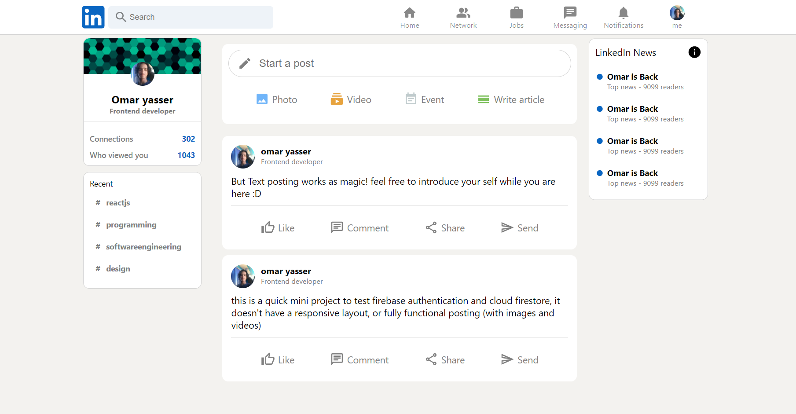

## Screenshots



# Project Title

LinkedIn home page clone (Not fully functional yet).
made with Reactjs, Redux, SCSS, and Firebase

## Features

- Register/ sign in
- Adding profile photo
- Posting and view posts

## Installation

Install linkedIn-clone with npm

```bash
  npm install
```

set up your project at [firebase console](https://firebase.google.com/)
(both authentication-with email and password- and cloud firestore must be enabled)

add your firebaseConfig (you can get it from your firebase app)
and place it at

src/firebase/firebase.js

then run

```bash
  npm start
```

all should be ready!

## Acknowledgements

the project was inspired by Sonny Sangha LinkedIn clone tutorial, special thanks for him!

- [Sonny Sangha](https://www.youtube.com/channel/UCqeTj_QAnNlmt7FwzNwHZnA)

## 🚀 About Me

I'm a software engineer, specialized in front-end development. while working as a freelancer, I enjoy learning new technologies to use, and practice my problem solving skills.

## 🔗 Links

[](https://omaryasser.me)

[](https://www.linkedin.com/omaryasserM)

## Support

For support, email omaryasser.dev@gmail.com.
